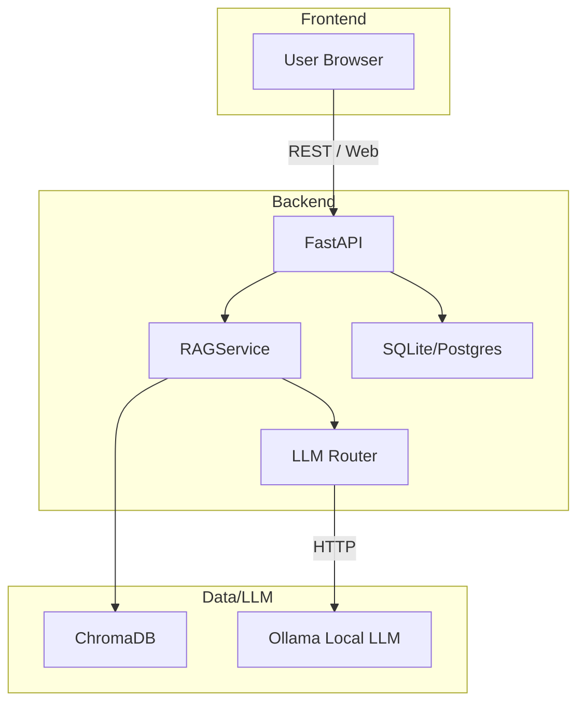

# NutriSync Architecture

This document describes the high-level architecture, component responsibilities, and the data flow for AaharAI NutriSync.

## System Overview

NutriSync is composed of three main layers:

- **Frontend** — Next.js application that provides the UI for onboarding, chat, meal plans and insights.
- **Backend** — FastAPI application which orchestrates RAG retrieval, LLM generation, authentication, persistence and business logic.
- **LLM & Vector Store** — Local Ollama LLM (primary) and ChromaDB vector store for retrieval.

## Component Diagram (Mermaid)

## Data Flow

1. User submits query via frontend.
2. Frontend sends request to FastAPI chat endpoint.
3. `RAGService.retrieve()` performs a vector query against ChromaDB to fetch top-K relevant chunks.
4. Retrieved chunks are augmented into a prompt and sent to `LLMRouter.generate()`.
5. `LLMRouter` sends the prompt to Ollama (local) or falls back to Groq (cloud) if configured.
6. Generated response is returned to the frontend and optionally stored in the chat history (SQLite/Postgres).

## Storage

- **ChromaDB**: vector store at `data/chroma_db` (persisted by Docker volume `chroma_data`).
- **App DB**: `backend/nutrisync.db` (SQLite by default, can be swapped to Postgres via `DATABASE_URL`).
- **Files**: `data/IFCT.pdf`, `data/AaharAI_NutriSync_Enhanced.xlsx` (source content for ingest).

## LLM Router Behavior

- Primary provider: Ollama (local). Configurable via `OLLAMA_BASE_URL` and `OLLAMA_MODEL`.
- Fallback provider: Groq (optional). Requires `GROQ_API_KEY`.
- Router supports health checks and a simple circuit-breaker to switch providers.

## Deployment Notes

- Use Docker Compose for local full-stack testing (`docker compose up --build -d`).
- For production: run backend behind a WSGI gateway, use a managed Postgres database, and host ChromaDB on persistent volumes.
- Ollama models can be large; consider GPU nodes for performance on large models.

## Security & Privacy

- Medical and personal data are stored locally by default. If you enable remote LLM providers, ensure encrypted transport and appropriate key management.

## Scaling Recommendations

- Separate ChromaDB and backend into separate nodes for high load.
- Use a managed vector store or hosted solution for very large indexes.

----

For more details, refer to `SETUP.md` and the source files in `/backend` and `/frontend`.
