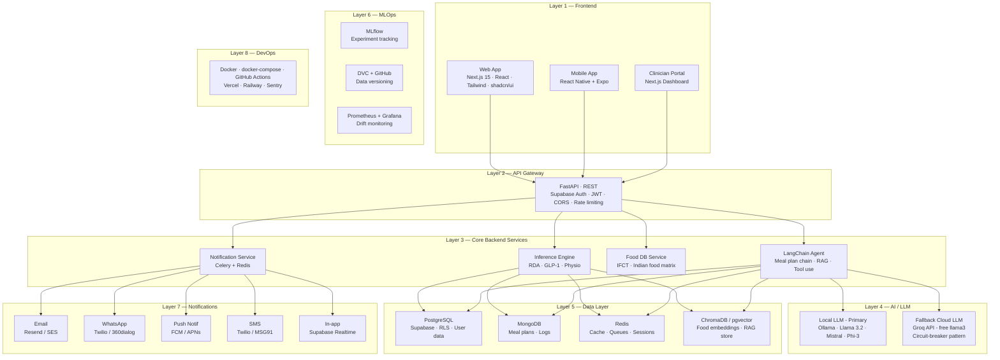
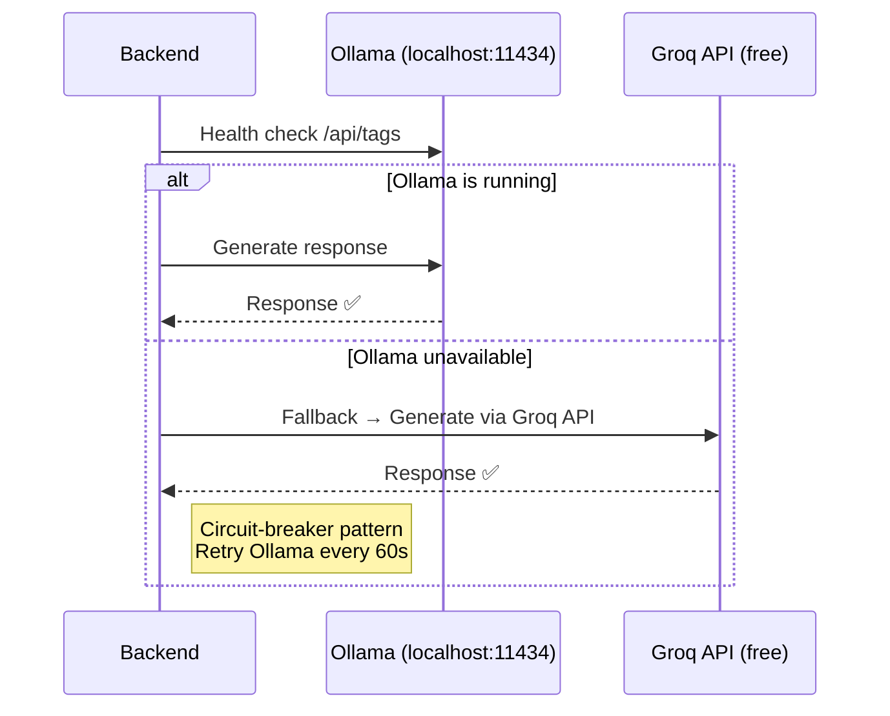
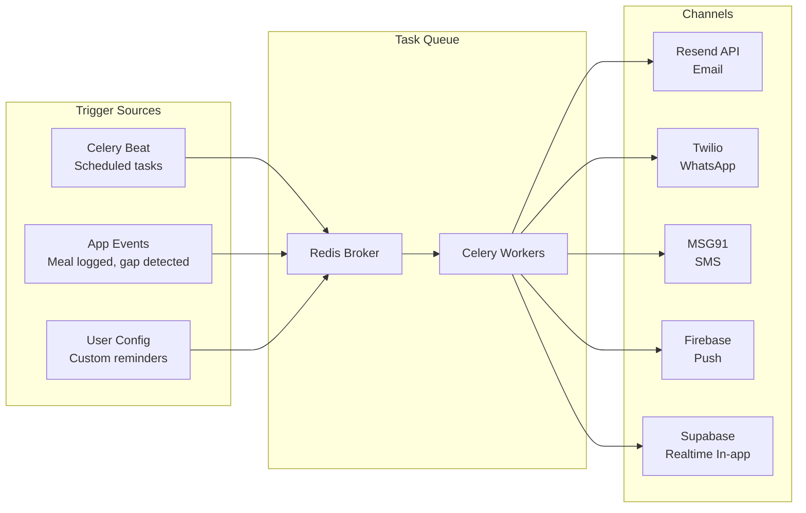

# AaharAI NutriSync — Full Implementation Plan

> Aligned with [nutrisync_full_architecture.svg](file:///Users/tharungowdapr/Desktop/idp/nutrisync_full_architecture.svg) — 8 layers, RAG + Agent, Ollama↔Groq fallback

---

## 1. Problem Statement

Build an AI-powered Indian nutrition assistant with:
- **RAG** over IFCT 2017 PDF + 12-sheet Excel database
- **Autonomous Agent** that plans meals within a budget, generates grocery lists, and provides recipes from available ingredients
- **LLM Fallback Chain**: Ollama (local) → Groq (free cloud) → vice versa
- **Multi-channel Notifications**: Email, SMS, WhatsApp, Push, In-app
- Fully deployable via Docker Compose

---

## 2. Architecture (8 Layers)



---

## 3. Tech Stack

| Layer | Technology | Role |
|---|---|---|
| **Frontend** | Next.js 15 + React 19 + Tailwind + shadcn/ui | Web app (PWA) |
| **Mobile** | React Native + Expo | iOS/Android (Phase 2) |
| **API Gateway** | FastAPI + Supabase Auth (JWT/OAuth2) | REST API + auth |
| **Agent** | LangChain (Agents + Tools + Chains) | Orchestrates RAG + meal planner + grocery |
| **LLM (Primary)** | Ollama (llama3.2 / mistral / gemma3) | Local inference, no API cost |
| **LLM (Fallback)** | Groq API (free llama3-70b) | Cloud fallback when Ollama unavailable |
| **Embeddings** | nomic-embed-text (Ollama) / HF all-MiniLM (fallback) | Document + query embeddings |
| **Vector Store** | ChromaDB (local) / pgvector (cloud) | RAG retrieval |
| **PDF Parsing** | PyMuPDF + pdfplumber | IFCT PDF text + table extraction |
| **DB (Structured)** | PostgreSQL (Supabase) | User profiles, auth, RLS |
| **DB (Flexible)** | MongoDB (Atlas free tier) | Meal plans, chat logs, grocery lists |
| **Cache/Queue** | Redis | Rate limiting, Celery broker, session cache |
| **Task Queue** | Celery | Async notifications, scheduled meal reminders |
| **Email** | Resend (free 100/day) or AWS SES | Meal reports, nutrient gap alerts |
| **SMS** | Twilio or MSG91 | GLP-1 dose reminders, critical alerts |
| **WhatsApp** | Twilio WhatsApp API | Daily meal reminders (India-preferred) |
| **Push** | Firebase Cloud Messaging (FCM) | Mobile push notifications |
| **In-app** | Supabase Realtime | WebSocket-based live notifications |
| **MLOps** | MLflow + DVC | Experiment tracking, data versioning |
| **Monitoring** | Prometheus + Grafana | Latency, nutrient accuracy drift |
| **DevOps** | Docker Compose + GitHub Actions + Vercel + Railway | CI/CD + deployment |

---

## 4. LLM Fallback Chain (Ollama ↔ Groq)



### Strategy
- On startup, check Ollama at `localhost:11434/api/tags`
- If available → use Ollama for all LLM + embedding calls
- If unavailable → switch to Groq API (free tier: 30 req/min, llama3-70b)
- **Circuit breaker**: After switching to Groq, retry Ollama every 60 seconds
- If Groq also fails → return cached response or graceful error
- Same strategy applies to embeddings: Ollama nomic-embed-text → HuggingFace all-MiniLM-L6-v2 (local via sentence-transformers)

---

## 5. Meal Planning Agent (NEW)

### What It Does

The agent is a **LangChain ReAct agent** with multiple tools. Given a user profile, it autonomously:

1. **Plans a weekly meal timetable** respecting nutrient targets, dietary preferences, and regional foods
2. **Factors in budget** — fetches approximate prices from web/API and optimizes within the user's daily/weekly budget
3. **Generates a grocery list** — aggregates all ingredients from the meal plan, converts to Indian portions (katori, cup, etc.), groups by store section
4. **Provides detailed recipes** — for any meal, generates step-by-step Indian cooking instructions using available ingredients

### Agent Architecture

```mermaid
graph TD
    USER[User Request<br/>"Plan my meals for ₹500/day"] --> AGENT[LangChain ReAct Agent]

    AGENT --> T1[Tool: NutrientCalculator<br/>Computes daily targets from profile]
    AGENT --> T2[Tool: FoodDatabase<br/>RAG search over IFCT + Excel]
    AGENT --> T3[Tool: PriceFetcher<br/>Web search for Indian grocery prices]
    AGENT --> T4[Tool: MealPlanner<br/>Greedy optimizer: nutrients vs budget]
    AGENT --> T5[Tool: GroceryListGenerator<br/>Aggregate + convert to Indian portions]
    AGENT --> T6[Tool: RecipeGenerator<br/>LLM generates recipe from ingredients]
    AGENT --> T7[Tool: RegionalFilter<br/>Filter foods by user's zone/state]

    T4 --> OUTPUT[Weekly Meal Plan<br/>+ Grocery List + Budget Breakdown]
```

### Agent Tools Detail

| Tool | Input | Output | Data Source |
|---|---|---|---|
| `NutrientCalculator` | User profile | Daily nutrient targets (kcal, protein, iron, etc.) | Inference Engine pipeline |
| `FoodDatabase` | Query (e.g. "high iron veg foods") | Matching foods with nutrient data | ChromaDB RAG |
| `PriceFetcher` | List of ingredients | Approximate prices in ₹ | Web scraping (BigBasket/JioMart) or cached price DB |
| `MealPlanner` | Targets + foods + budget | 4 meals/day × 7 days | Optimization algorithm |
| `GroceryListGenerator` | Weekly meal plan | Grouped grocery list with quantities | Portion conversion sheet |
| `RecipeGenerator` | Ingredients list + meal type | Step-by-step Indian recipe | LLM generation |
| `RegionalFilter` | Zone/state | Filtered food list | Regional Food Culture sheet |

### Budget-Aware Meal Planning Logic

1. User specifies daily/weekly budget (e.g., ₹500/day)
2. Agent fetches current grocery prices (cached, refreshed weekly)
3. For each meal slot, selects foods that:
   - Maximize nutrient density score
   - Stay within per-meal budget allocation (breakfast 20%, lunch 35%, snack 10%, dinner 35%)
   - Respect diet type, GLP-1 constraints, disease protocols
4. If budget is tight → prioritize dal, ragi, seasonal vegetables, eggs (highest nutrient-per-rupee)
5. Output includes per-item cost breakdown

### Recipe Generation

- When user clicks a meal → agent generates a detailed recipe
- Uses the **exact ingredients and quantities** from the meal plan
- Adapts to available ingredients (user can mark items as "not available")
- Substitution logic from Context Resolver rules
- Recipes are Indian-style with cooking methods (tadka, tempering, pressure cooker times)

---

## 6. Notification System (NEW)

### Notification Types & Channels

| Notification | Trigger | Channels | Priority |
|---|---|---|---|
| **Daily meal reminder** | 7 AM, 12 PM, 6 PM | WhatsApp (primary), Push, In-app | Medium |
| **Grocery shopping reminder** | Weekly (Saturday AM) | WhatsApp, Email | Low |
| **Nutrient gap alert** | Weekly analysis | Email (detailed report), Push (summary) | High |
| **GLP-1 dose reminder** | User-configured time | SMS + Push (critical) | Critical |
| **Medicine-food timing** | 30 min before meal | Push, In-app | High |
| **Water intake reminder** | Every 2 hours | Push, In-app | Low |
| **Weekly progress report** | Sunday evening | Email (charts + summary) | Medium |

### Architecture



### User Preferences
- Users configure which channels they want (WhatsApp + Push default for India)
- Quiet hours (10 PM – 7 AM) — no notifications except critical (GLP-1 dose)
- Frequency control: daily / 3x-week / weekly per notification type

---

## 7. RAG Pipeline

### Ingestion (One-time)

| Source | Parsing | Chunking | Metadata |
|---|---|---|---|
| IFCT PDF (~500 pages) | PyMuPDF (text) + pdfplumber (tables) | 512 tokens, 50 overlap | `source`, `page`, `section` |
| Excel — 12 sheets | Pandas → text serialization per row | 1 row = 1 document | `sheet`, `food_name`, `group`, `diet_type` |

### Retrieval Strategy
- **Search**: MMR (Maximum Marginal Relevance), top-k=5
- **Pre-filter**: Metadata filtering by `source`, `food_group`, `condition` before similarity search
- **Score threshold**: 0.3 minimum

### Prompt Structure
```
[SYSTEM] You are AaharAI NutriSync, an expert Indian nutrition assistant...
[USER CONTEXT] Life stage, conditions, GLP-1 status, region, diet type
[RETRIEVED CHUNKS] 5 relevant passages from IFCT/Excel with source citations
[USER QUERY] The user's question
```

---

## 8. Backend Modules

| Module | File | Responsibility |
|---|---|---|
| **Data Loader** | `database/loader.py` | Excel → DataFrames (singleton, startup) |
| **RAG Ingestion** | `rag/ingest.py` | PDF + Excel → chunks → embed → ChromaDB |
| **RAG Service** | `rag/service.py` | Retrieve + augment + generate |
| **LLM Router** | `rag/llm_router.py` | Ollama ↔ Groq fallback with circuit breaker |
| **Meal Agent** | `agent/meal_agent.py` | LangChain ReAct agent with 7 tools |
| **Price Fetcher** | `agent/tools/price_fetcher.py` | Web scrape grocery prices |
| **Grocery Generator** | `agent/tools/grocery_generator.py` | Meal plan → grouped shopping list |
| **Recipe Generator** | `agent/tools/recipe_generator.py` | Ingredients → Indian recipe via LLM |
| **Inference Engine** | `engines/inference_engine.py` | RDA → profession → disease → GLP-1 → physio → resolver |
| **GLP-1 Modifier** | `engines/glp1_modifier.py` | Caloric reduction + protein floor |
| **Physio Mapper** | `engines/physio_mapper.py` | Energy/sleep/focus → nutrient boosts |
| **Context Resolver** | `engines/context_resolver.py` | Multi-context conflict handler |
| **Notification Manager** | `notifications/manager.py` | Celery tasks for all channels |
| **Email Service** | `notifications/email.py` | Resend API integration |
| **SMS/WhatsApp** | `notifications/sms_wa.py` | Twilio/MSG91 integration |
| **Push Service** | `notifications/push.py` | FCM integration |

---

## 9. Project File Structure

```
Nutritional-Assistant/
├── data/
│   ├── AaharAI_NutriSync_Enhanced.xlsx
│   ├── IFCT.pdf
│   └── chroma_db/                        # Auto-created vector store
│
├── backend/
│   ├── main.py                           # FastAPI app
│   ├── config.py                         # Settings + env vars
│   ├── requirements.txt
│   ├── database/
│   │   ├── loader.py                     # Excel → DataFrames
│   │   └── models.py                     # Pydantic schemas
│   ├── rag/
│   │   ├── ingest.py                     # PDF + Excel → ChromaDB
│   │   ├── service.py                    # RAG query pipeline
│   │   └── llm_router.py                # Ollama ↔ Groq fallback
│   ├── agent/
│   │   ├── meal_agent.py                 # LangChain ReAct agent
│   │   └── tools/
│   │       ├── nutrient_calculator.py
│   │       ├── food_database.py
│   │       ├── price_fetcher.py
│   │       ├── meal_planner.py
│   │       ├── grocery_generator.py
│   │       ├── recipe_generator.py
│   │       └── regional_filter.py
│   ├── engines/
│   │   ├── inference_engine.py
│   │   ├── glp1_modifier.py
│   │   ├── physio_mapper.py
│   │   ├── lifestage_rda.py
│   │   ├── context_resolver.py
│   │   ├── disease_protocol.py
│   │   ├── profession_calorie.py
│   │   └── regional_food.py
│   ├── notifications/
│   │   ├── manager.py                    # Celery task dispatcher
│   │   ├── email.py                      # Resend / SES
│   │   ├── sms_wa.py                     # Twilio / MSG91
│   │   ├── push.py                       # FCM
│   │   └── inapp.py                      # Supabase Realtime
│   ├── routes/
│   │   ├── nutrition.py
│   │   ├── meal_plan.py
│   │   ├── chat.py
│   │   ├── grocery.py
│   │   ├── recipes.py
│   │   ├── notifications.py
│   │   └── data.py
│   └── tests/
│
├── frontend/                             # Next.js 15
│   ├── src/app/
│   │   ├── page.js                       # Dashboard
│   │   ├── onboarding/page.js
│   │   ├── meal-plan/page.js
│   │   ├── grocery/page.js               # Grocery list view
│   │   ├── recipes/page.js               # Recipe viewer
│   │   ├── food-explorer/page.js
│   │   ├── analysis/page.js
│   │   ├── chat/page.js
│   │   └── settings/page.js              # Notification preferences
│   └── src/components/
│
├── NutriSync_Analysis.ipynb
├── docker-compose.yml
├── Dockerfile.backend
├── Dockerfile.frontend
├── README.md
└── .gitignore
```

---

## 10. API Endpoints

| Method | Endpoint | Purpose |
|---|---|---|
| `POST` | `/api/chat` | RAG chat with source citations |
| `POST` | `/api/nutrition/targets` | Compute personalized nutrient targets |
| `POST` | `/api/meal-plan/generate` | Agent generates weekly meal plan within budget |
| `GET` | `/api/meal-plan/{plan_id}` | Retrieve saved meal plan |
| `POST` | `/api/grocery/generate` | Generate grocery list from meal plan |
| `POST` | `/api/recipes/generate` | Generate recipe from ingredients |
| `POST` | `/api/recipes/substitute` | Suggest substitute ingredients |
| `GET` | `/api/data/foods` | Search/filter foods |
| `GET` | `/api/data/foods/{name}` | Full nutrient profile |
| `POST` | `/api/notifications/configure` | Set notification preferences |
| `GET` | `/api/notifications/history` | View past notifications |
| `GET` | `/api/health` | Health check (Ollama status, DB, ChromaDB) |

---

## 11. Deployment

### Docker Compose (Full Stack)

| Container | Image | Port | Notes |
|---|---|---|---|
| `ollama` | `ollama/ollama` | 11434 | GPU passthrough if available |
| `backend` | Custom (FastAPI) | 8000 | + Celery worker in same container |
| `frontend` | Custom (Next.js) | 3001 | SSR mode |
| `redis` | `redis:alpine` | 6379 | Celery broker + cache |
| `chromadb` | `chromadb/chroma` | 8001 | Vector store |
| `mongodb` | `mongo:7` | 27017 | Meal plans + logs |

### Cloud Deployment

| Component | Platform | Cost |
|---|---|---|
| Frontend | Vercel (free) | $0 |
| Backend + Celery | Railway ($5/mo hobby) | $5/mo |
| MongoDB | Atlas (free 512MB) | $0 |
| PostgreSQL | Supabase (free) | $0 |
| Redis | Upstash (free 10k/day) | $0 |
| LLM | Groq (free tier) | $0 |

> [!TIP]
> **Total cloud cost: ~$5/month** using free tiers. Ollama runs locally on your Mac for development, Groq handles cloud requests.

---

## 12. Suggested Improvements (Beyond SVG)

| Improvement | Rationale |
|---|---|
| **Food photo recognition** | Use a vision model (LLaVA via Ollama) to identify food from photos and auto-log meals |
| **Voice input (Hindi + English)** | Whisper (local via Ollama) for voice-based meal logging — critical for rural Indian users |
| **Family meal planning** | Plan for entire families with different life stages (pregnant mother + toddler + elderly parent) |
| **Seasonal food calendar** | Weight recommendations toward seasonal Indian produce for freshness + cost savings |
| **Fasting protocol support** | Support Navratri, Ramadan, Ekadashi fasting with nutrient-safe food alternatives |
| **Grocery delivery integration** | Direct order placement via BigBasket/Zepto/JioMart API |
| **Wearable integration** | Sync Apple Health / Google Fit for activity-adjusted calorie targets |
| **Community recipes** | User-submitted recipes scored by nutrient density — gamification via points |

---

## 13. Development Phases

| Phase | Duration | Deliverables |
|---|---|---|
| **Phase 1 — Foundation** | 4-5 days | Data loader, RAG pipeline, LLM router (Ollama↔Groq), basic chat |
| **Phase 2 — Engines** | 4-5 days | All 8 inference engines, context resolver, API endpoints |
| **Phase 3 — Agent** | 4-5 days | Meal planning agent, budget optimizer, grocery list, recipe generation |
| **Phase 4 — Frontend** | 4-5 days | All 8 pages (dashboard, onboarding, meal plan, grocery, recipes, explorer, analysis, chat) |
| **Phase 5 — Notifications** | 2-3 days | Celery + Redis setup, email, SMS, WhatsApp, push, in-app |
| **Phase 6 — Polish + Deploy** | 3-4 days | Docker Compose, testing, deployment, documentation |

---

## 14. Verification Plan

### Automated
- Unit tests for each engine module
- RAG retrieval quality: query → assert relevant chunks in top-5
- Agent tool tests: budget optimization, grocery aggregation
- LLM fallback: simulate Ollama down → verify Groq kicks in

### Manual
- Full onboarding → meal plan → grocery list → recipe flow
- Test with various profiles: pregnant vegetarian, GLP-1 diabetic, athlete
- Notification delivery verification across all channels
- Budget accuracy: actual grocery costs vs planned budget
